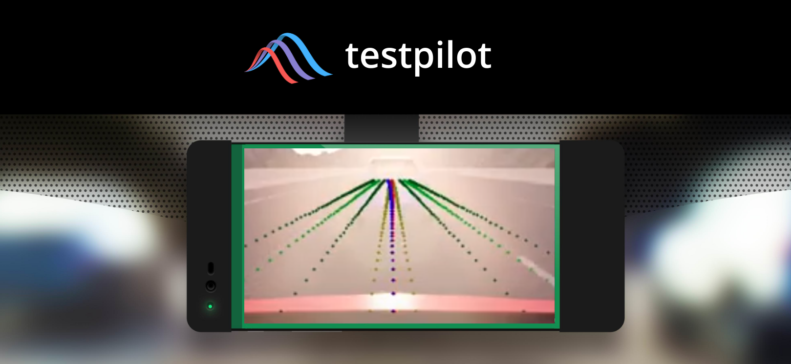
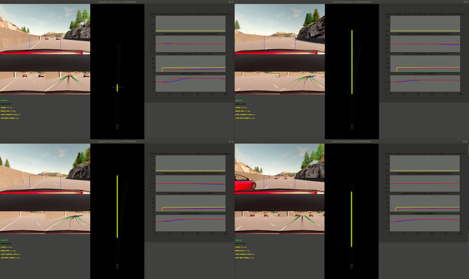

<p align="center">
  
</p>

Welcome to TestPilot
======
> **WARNING**: This repository is provided solely for simulation research purposes. It should not be used to drive cars. 

TestPilot is a minimally invasive fork of OpenPilot 0.5, a SAE Level 2 driver-assistance system designed to be integrated with Comma AI's proprietary camera hardware and a customized software platform based on the Android operating system. TestPilot eliminates the need for ARM and Qualcomm hardware enabling reliable, synchronous, and deterministic execution of the full OpenPilot stack on your desktop computer. TestPilot includes a simple OpenAI gym like interface to CARLA and is executed within a Docker container such that multiple TestPilot agents can run simultaneously on the same computer.

### Running SNPE on X86
A primary challenge associated with testing OpenPilot in a simulated environment is the tight integration between the neural networks in the perception system and the EON hardware. The networks are distributed in binary form and use the Snapdragon Neural Processing Engine (SNPE) accelerator. The first network, ``posenet``, infers the motion of the camera sensor (rather than to localize the vehicle in a map). The predicted motion allows OpenPilot to estimate the three-dimensional locations of objects detected by the ``driving_model`` network. 
Our fork, TestPilot, utilizes an SNPE SDK feature which enables the execution of network binaries using OpenCL. Additionally, we create a fake camera driver which inputs simulated, recorded, or real images from any source
into an OpenCL memory buffer. A handful of additional modifications were made to the build script in order to source X86 compatible versions of dependencies; however, they do not alter the underlying perception modules.

### Synchronous execution
Deploying the planning and control elements together with the perception pipeline in a simulation environment requires further refinements. The perception and planning elements use a real-time clock to stamp vehicle-state messages. However, the simulation clock does not necessarily match wall-clock time. To address this problem, TestPilot receives a clock signal from the simulator. Furthermore, OpenPilot heavily utilizes asynchronous message passing; this induces non-determinism in the execution order of the control stack. In order to improve the repeatability of the experiments, TestPilot forces sequential execution of the control components. Lastly, OpenPilot utilizes a PID controller operating at 100Hz to actuate steering and throttle mechanisms and track the desired state (updated by the planning module at 20Hz). In order to avoid significant time costs and execute the simulator at 20Hz, TestPilot sends its planning module's desired state to the simulator, and we perform tracking on the simulator side.

### Other notes
Valgrind and GDB will work if you enabled Docker to run in privileged mode. 

## Citing

If you find this code useful in your work, please consider citing our [paper](https://arxiv.org/abs/1912.03618):

```
@article{norden2019efficient,
  title={Efficient black-box assessment of autonomous vehicle safety},
  author={Norden, Justin and O'Kelly, Matthew and Sinha, Aman},
  journal={arXiv preprint arXiv:1912.03618},
  year={2019}
}
```

# Dependencies
We have tested the code on Ubuntu 16.04, 18.04, and 20.04 machines. It is likely that the code will run (in Docker) on correctly configured OSX and Windows machines but we do not provide any support for these operating systems.

## Python 3.7
Depending on your Linux distro this should already be preinstalled. This dependency is due to the requirements of CARLA 0.9.9 rather than any aspect of TestPilot.

## SNPE
1. Create a Qualcomm developer account at https://myaccount.qualcomm.com/signup?target=https%3A%2F%2Fdeveloper.qualcomm.com
2. Download SNPE version 1.25.1.310 from: https://developer.qualcomm.com/download/qualcomm-neural-processing-sdk-ai-v1251?referrer=node/34505
3. Unzip the download `snpe-1.25.1.zip` into `testpilot/testpilot0.5`

## Docker
Install [Docker for Ubuntu](https://docs.docker.com/engine/installation/linux/docker-ce/ubuntu/). Make sure to `sudo usermod -aG docker your-user` and then you do not need to run below docker scripts as `sudo`

## Python Libraries
Dependencies are detailed in requirements.txt
* `colorama 0.4.3`
* `cython 0.29.21`
* `numba 0.51.2`
* `numpy 1.19.2`
* `opencv-python 4.4.0.42`
* `pygame 1.9.6`
* `pyzmq 19.0.2`

Newer versions of these libraries likely work but have not been tested.

## CARLA (to run the demo)
Get CARLA from https://github.com/carla-simulator/carla/releases. We have validated TestPilot with CARLA releases 0.9.6, 0.9.9.4, and 0.9.10.1. Note that for 0.9.9.x and above, visuals and weather look best using Vulkan instead of OpenGL when running CARLA. 


# Setup
0. Run `pip3 install -r requirements.txt`
1. Run `cmd/createDockerNet.sh`
2. Navigate to `testpilot/testpilot0.5`
3. Run `build_docker.sh`

# Running the demo
0. Start CARLA on port 2010.
	
	An example of this command would be `DISPLAY= ./CarlaUE4.sh -opengl -quality-level=Epic -carla-world-port=2010` from a directory that contains the binary `CarlaUE4.sh`
1. Run `export PYTHONPATH=$PYTHONPATH:<path-to-carla>/PythonAPI/carla/dist/carla-<carla_version_and_arch>.egg`
2. Navigate to `demo`
3. Run `python3 demo.py`

Optionally run `python3 demo.py --help` for more options like starting multiple agents.
Here is an example of 4 TestPilot agents running together:
<p align="center">
  
</p>

Licensing
------

TestPilot is released under the MIT license. Some parts of the software are released under other licenses as specified.

Any user of this software shall indemnify and hold harmless Trustworthy AI, Inc. and its directors, officers, employees, agents, stockholders, affiliates, subcontractors and customers from and against all allegations, claims, actions, suits, demands, damages, liabilities, obligations, losses, settlements, judgments, costs and expenses (including without limitation attorneys’ fees and costs) which arise out of, relate to or result from any use of this software by user.

**THIS IS ALPHA QUALITY SOFTWARE FOR RESEARCH PURPOSES ONLY. THIS IS NOT A PRODUCT.
YOU ARE RESPONSIBLE FOR COMPLYING WITH LOCAL LAWS AND REGULATIONS.
NO WARRANTY EXPRESSED OR IMPLIED.**

---

